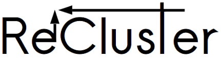

## <b>Ordination Methods for the Analysis of Beta-Diversity Indices</b>


The analysis of different aspects of biodiversity requires specific algorithms. For example, in regionalisation analyses, the high frequency of ties and zero values in dissimilarity matrices produced by Beta-diversity turnover produces hierarchical cluster dendrograms whose topology and bootstrap supports are affected by the order of rows in the original matrix. Moreover, visualisation of biogeographical regionalisation can be facilitated by a combination of hierarchical clustering and multi-dimensional scaling. The recluster package provides robust techniques to visualise and analyse pattern of biodiversity and to improve occurrence data for cryptic taxa.


<b>Sources:</b>

Dapporto L., Ramazzotti M., Fattorini S., Talavera G., Vila R., & Dennis R. L. (2013). recluster: an unbiased clustering procedure for beta‐diversity turnover. Ecography, 36(10), 1070-1075.

Platania L., Menchetti M., Dinca V., Corbella C., Kay-Lavelle I., Vila R., Wiemers M., Schweiger O., Dapporto L. (2020). Assigning occurrence data to cryptic taxa improves climatic niche assessments: biodecrypt, a new tool tested on European butterflies. Global Ecology and Biogeography, DOI:10.1111/geb.13154.

To install recluster use:
```
install.packages("remotes")

remotes::install_github("leondap/recluster")
```

### The zero problem

The dissimilarity indexes of turnover can provide fundamental information in the analysis of beta-diversity patterns but the distance matrices produced on occurrence data show peculiar features:

1) the triangular relationship is rarely met
2) in case of highly nested pattern, the dissimilarity matrix contains many pairs having zero and tied dissimilarity producing problematic cases in clustering

We inspect the data of butterflies of Western Mediterranean islands

```
library(recluster)
data(dataisl)
data(treebut)
```

Calculate the Simpson dissimilatity matrix based on occurrence data

```
simpdiss_b <- recluster.dist(dataisl)
recluster.hist(simpdiss_b)
```

The recluster package includes a function to inspect the fraction of zero and tied values

```
recluster.hist(simpdiss_b)
```
https://github.com/leondap/images/blob/main/cluster%201.png?raw=true(https://github.com/leondap/images/blob/main/histogram.png?raw=true)

So there are 27 tied 0 values and no other tied cells. This potentially creates problems in hierarchical clustering because at the first step the algorithm has to choose between several minimum dissimilarity to create the first link. Actually, when tied values occur, several solutions are possible at each agglomeration step and many different trees may be generated. Statistical packages typically do not cope with this flaw but use arbitrary linking rules (e.g. select the first pair with dissimilarity = 0 in a matrix). Bootstrapping systematically re-samples species but maintains the original order of sites. Consequently, the pairs linked in the first reference tree are more likely to be linked during the entire bootstrap procedure resulting in false strong supports.

The effect of the bias can be easily realised by launching several times a hierarchical clustering by randomly reordering the order of the areas in the matrix which should not affect the topology

```
dataislrnd<-dataisl[sample(1:nrow(dataisl)),]
simpdiss_rnd <- recluster.dist(dataislrnd)
plot(hclust(simpdiss_rnd))
```
Two random examples here show the possible differences among solutions:


Any biogeographical interpretations based on these spurious relationships might be inconsistent

### To solve this problem, recluster.cons function produces a series of trees after randomly re-ordering the row order and creates a consensus tree (0.5 consensus rule by default). By replicating these procedure on subsets of species a bootstrap analysis among the consensus trees can be also computed by recluster.boot.


```
tree_bf <- recluster.cons (dataisl, p=0.5,method="average")$cons
plot(tree_bf, direction="downwards")
```


This tree is resistant to changing the order of the row and shows that the internal division among some groups of areas have no meaning
